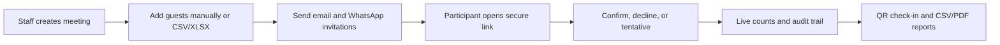

# Bukoba Municipal Council Meetings

> A bilingual, mobile-first meeting workspace for planning, invitations, RSVP, attendance, and official records.


The system gives council staff one place to create physical or virtual meetings, manage guests, send email and WhatsApp invitations, collect RSVP responses, run QR attendance check-in for physical meetings, and download records. Participants use a secure link and do not need an account.

## What it does



| Area | Available now |
|---|---|
| Staff access | Registration, email OTP verification, password login, password reset, roles, sessions |
| Meetings | Draft and published physical or virtual meetings, ownership rules, editing, rescheduling, cancellation |
| Guests | Manual entry, CSV/XLSX import, invitation status, RSVP tracking |
| Messaging | SMTP email and optional Meta WhatsApp Cloud API with templates |
| Attendance | Rotating QR code and personal participant links for physical meetings; virtual meetings distribute the online meeting link |
| Administration | Staff management, attendance overview, audit log, integration status, system log download |
| Records | Meeting CSV/PDF reports, staff/attendance/audit CSV exports, full application log download |
| Experience | Responsive PWA shell, English and Kiswahili UI, offline status banner |

## Quick start

### Prerequisites

- Java 21
- Maven
- PostgreSQL 15 or newer, or Docker Desktop
- Node.js and npm for frontend development
- A modern browser

<details>
<summary>Start the local stack</summary>

```powershell
Copy-Item .env.example .env
docker compose up -d postgres
mvn -f backend\pom.xml spring-boot:run
```

Open `http://127.0.0.1:8000`.

The administrator is seeded from `ADMIN_EMAIL` and `ADMIN_PASSWORD`. Change both values before any shared or production deployment.
</details>

<details>
<summary>Run the frontend separately</summary>

```powershell
cd frontend
npm install
npm run dev
```

Vite runs on port `5173` and proxies `/api` to the backend on port `8000`.

Build the production frontend with:

```powershell
npm run build
```
</details>

<details>
<summary>Useful checks</summary>

```powershell
mvn -f backend\pom.xml test
mvn -f backend\pom.xml clean package
```

The packaged backend JAR is written to `backend/target` and the frontend build is written to `frontend/dist`.
</details>

## First-use path

1. Sign in as the seeded administrator.
2. Open **Administration** and confirm staff accounts and integration status.
3. Create a physical or virtual meeting and add guests manually or with the XLSX template. Virtual meetings require an online meeting link and do not use a venue or physical attendance QR.
4. Publish the meeting and send invitations.
5. Monitor RSVP responses from the meeting detail view.
6. For physical meetings, display the rotating attendance QR code during the meeting. For virtual meetings, participants use the distributed online meeting link.
7. Download the meeting report, attendance CSV, audit CSV, or full system log when needed.

Participants open `/rsvp.html?token=...` for RSVP and `/attendance.html?token=...` for QR attendance. No participant account is required.

## WhatsApp setup

WhatsApp is optional and disabled by default. Add the Meta Cloud API values to `.env`, restart the backend, then test delivery from **Administration > Integrations**.

```env
WHATSAPP_ENABLED=true
WHATSAPP_API_URL=https://graph.facebook.com/v21.0
WHATSAPP_PHONE_NUMBER_ID=your_phone_number_id
WHATSAPP_ACCESS_TOKEN=your_access_token
WHATSAPP_USE_TEMPLATES=true
WHATSAPP_TEMPLATE_NAME=hello_world
WHATSAPP_TEMPLATE_LANGUAGE=en_US
```

See [docs/whatsapp-test-setup.md](docs/whatsapp-test-setup.md) for Meta test recipients, templates, phone formatting, and production notes.

## Repository map

```text
backend/       Spring Boot API, persistence, security, reports, integrations
frontend/      React/Vite PWA, staff dashboard, RSVP, attendance pages
docs/          API, requirements, deployment, QA, manuals, and handover
templates/     Guest import and notification templates
screenshots/   Optional screenshots used in this README and project documentation
```

## Screenshots

Add project images to `screenshots/` using descriptive filenames, then reference them in Markdown:

```markdown

```

Keep screenshots free of real participant contact details, access tokens, and private meeting data.

## Documentation guide

- [API reference](docs/api-reference.md)
- [Environment configuration](docs/environment-configuration.md)
- [Deployment guide](docs/deployment-guide.md)
- [Database schema](docs/database-schema.md)
- [English and Kiswahili user manual](docs/user-manual-en-sw.md)
- [Test plan](docs/test-plan.md)
- [Future ideas and scope notes](docs/proposal.md#future-ideas)

## Branding and production readiness

Use only council-approved Coat of Arms and Bukoba Municipal Council logo assets. Configure HTTPS, production database credentials, SMTP, WhatsApp credentials, backups, and `PUBLIC_BASE_URL` before go-live. Never commit `.env` or provider tokens.

## Future ideas

The following items appeared in earlier planning material but are not implemented in the current application: Google Calendar and Microsoft Graph OAuth, automatic ICS links, calendar conflict warnings, configurable reminders, SMS fallback, historical analytics, Director read-only dashboards, advanced duplicate/import review, bilingual generated reports, and full provider webhook orchestration. They are retained as a backlog in the project proposal rather than presented as current functionality.
